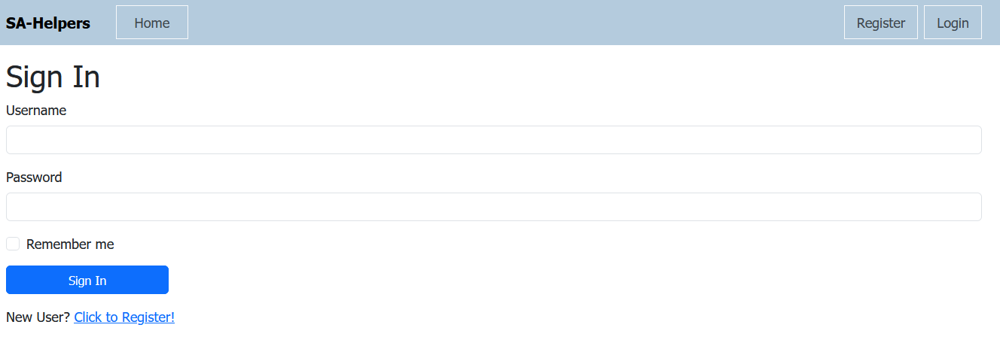
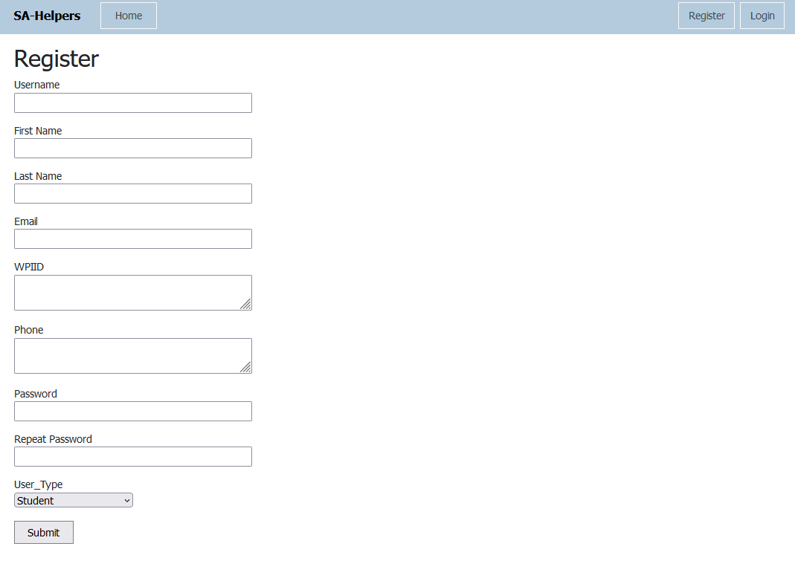
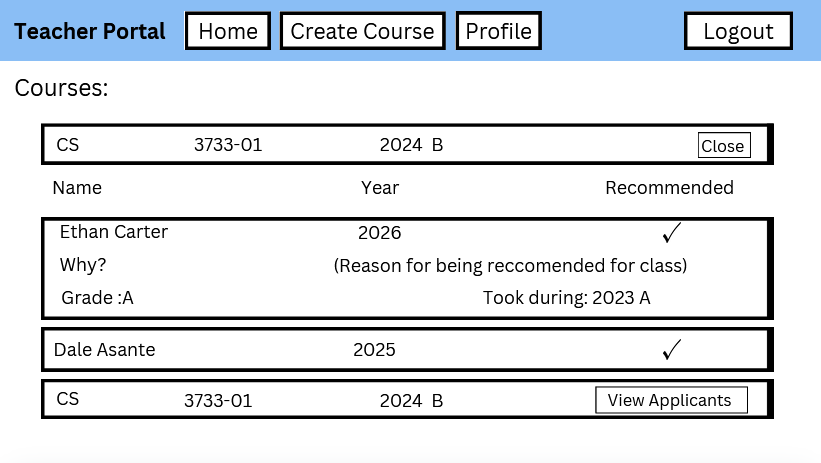
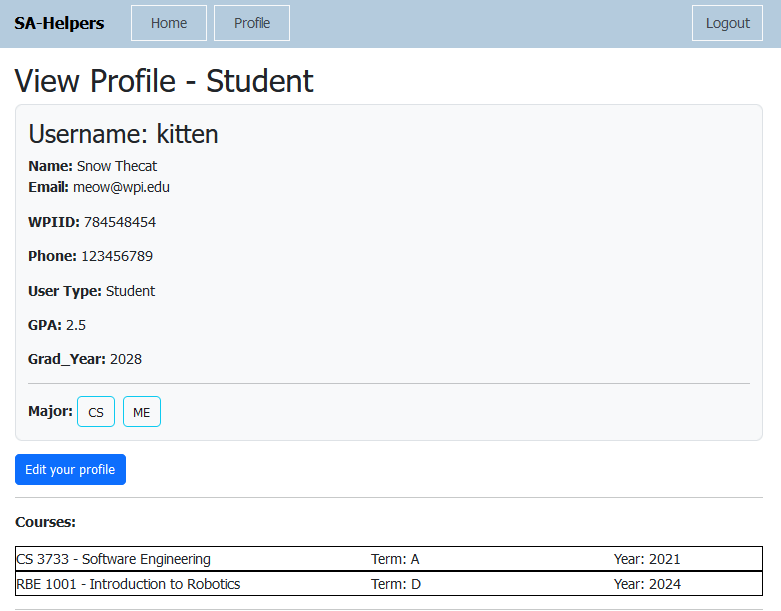
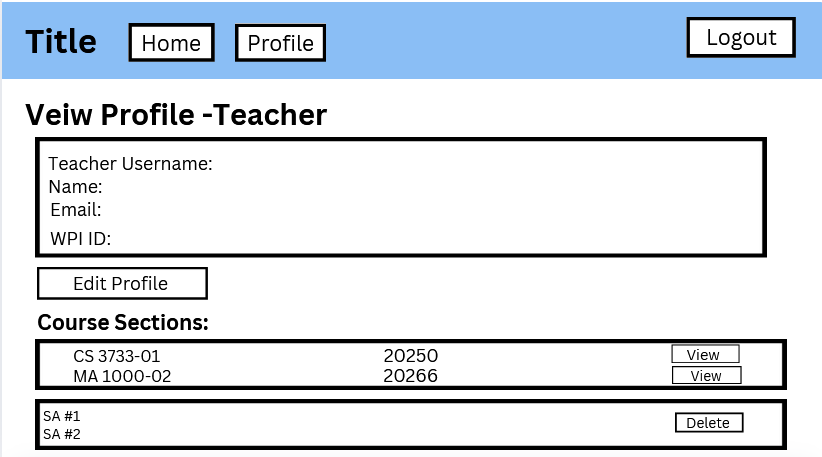
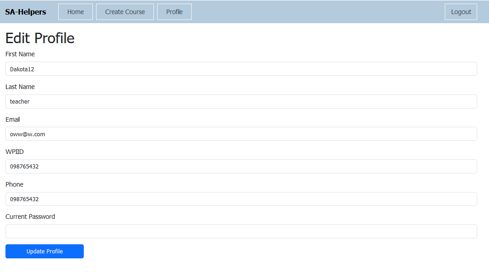

# Software Requirements and Use Cases

## Student Assistant Application System
--------
Prepared by:

* Alicia Zhu, WPI - Computer Science
* Dale Asante, WPI - Computer Science, Psychology 
* Ethan Carter, WPI - Computer Science, IMGD
* Dakota Wellerbrady, WPI - Computer Science

---

**Course**: CS 3733 - Software Engineering

**Instructor**: Sakire Arslan Ay

---

## Table of Contents
- [1. Introduction](#1-introduction)
- [2. Requirements Specification](#2-requirements-specification)
  - [2.1 Customer, Users, and Stakeholders](#21-customer-users-and-stakeholders)
  - [2.2 User Stories](#22-user-stories)
  - [2.3 Use Cases](#23-use-cases)
- [3. User Interface Requirements](#3-user-interface)
- [4. Product Backlog](#4-product-backlog)
- [5. References](#5-references)
- [Appendix: Grading Rubric](#appendix-grading-rubric)

---

## Document Revision History

| Name | Date | Changes | Version |
| ------ | ------ | --------- | --------- |
| Revision 1 | 2024-11-03 | Initial draft | 1.0 |
| Revision 2 | 2024-11-05 | Added user stories, refined introduction and Stakeholders, Customers, and Users section | 1.1 |
| Revision 3 | 2024-11-06 | Refined and added more user stories, started adding some use cases | 1.2 |
| Revision 4 | 2024-11-07 | Added use cases and mockup images | 1.3 |

---

# 1. Introduction

The Student Assistant Position Application System is a web-based platform designed to streamline the process of managing student assistant (SA) positions at an academic institution, in this case, Worcester Polytechnic
Institute. Its primary purpose is to connect students seeking SA roles to faculty looking for students assistants in a much more fluid and effective way than what is done now. This application makes the process of
searching for courses as a student and searching for students as a faculty members more accessible and much quicker as some of teh key features include personalized job recommendations based of qualifications, deatailed
course search, and notifications when spots are signed up for. 

### Key Benefits
- Enhances user satisfaction by making navigation intuitive.
- Aids in making the application for SA-ship process easier for students and faculty.
- Helps students find suitable positions based on their qualifications.
- Provides notifications about application statuses and new openings.

### Objectives
- Enable management of SA applications.
- Facilitate the recruitment process.

### Goals
- Increase student participation in SA opportunities.
- Optimize recruitment efficiency.
- (add a phrasing of making the process of applying for SA easier)
---

# 2. Requirements Specification

## 2.1 Stakeholders, Customers, and Users

**Stakeholders** include:

- **Students** looking for Student Assistant positions.
- **Faculty** searching for students to hire for Student Assistant positions.
- **Universities and Institutions** endorsing and overseeing the use of the app, attempting to make this search a much easier and effective one.
-   Career Services and Student Employment office can benefit from the use of this application as well
- **App developers and designers** who create, style, maintain, and guarantee the functionality and proper usage of the app.
- **IT/Security** responsible for the safety and privacy of the users of the app.
- **Investors/Sponsors** supporting and funding the app.
- **Parents (????)** ensuring that their children have optimal and quality emplyment opportunities.

**Customers** include:

**End Users**
- **Students** looking for Student Assistant opportunities that match their qualifications, schedules, and other needs.
- **Faculty** looking for a better way to post availablity and openings for Student Assistant positions, as well as selecting and hiring them.

**Paying Customers/Sponsors**
- **Institutions** that would like to use the app to aid in their process of asssigning SAs to courses
-   Student Employment Office can use the app to help facilitate job searching

**Users** consist of:
- **Develepors and Designers** will manage backend operations and ensure system efficiency.
- **Administrative Staff** will use this app to connect students and faculty for faster and more efficient job searching.
- **Students** will search and apply for SA positions, being able to properly organize applications and benefit from personalized job recommendations.
- **Faculty Members** will post courses and SA availability slots and be able to view and choose from a pool of student applicants that have appplied to their posted courses.

## 2.2 User Stories

## 1. Account Management
- As a student, I want to enter the courses I have served as an SA for before as well as courses I received an A for so that the system can make better recommendations for me. 
- As a student, I want to edit my profile information to keep it up to date or make any necessary changes.
- As a student, I want to be able to share my contact information so that professors can reach out to me personally.
- As a faculty member, I want to edit my profile information to keep it up to date or make any neccessary changes.
- As an administrator, I want students and faculty to be able to register for separate accounts so that they can interact with each other properply and efficiently.

## 2. Creating Positions
- As a faculty member, I want to create student assistant positions for my courses so that I can hire students to be an assistant in my class.
- As a faculty member, I want to specify requirements and qualifications necessary to be a student assistant in my class so that I can choose suitable assistants.
- As a faculty member, I want to allow students to submit a brief description about why they want this position and what they will bring to the table.
- As a faculty member, I want to allow students to submit their previous work and SA experience so that I can gauge their previous work experience better.
- As a faculty member, I want to know what their experience and grades were taking this course so I know what to expect from them and whether they are qualified for this job.
- As an administrator, I want to add courses to the course catalog so that faculty members can choose from them for creating their SA positions.
- As an administrator, I want to specifiy the number of SAs needed for a course so that there is no overenrollment.

## 3. Viewing and Searching For Positions
- As a student, I want to view all open student assistant positions to find job opportunities.
- As a student, I want detailed information about each position to assess my qualifications.
- As a student, I want to see recommended positions based on my qualifications.
- As a student, I want to view recommended positions in order of how qualified I am for them so that I can choose the most suitable job opportunity.
- As a student, I want to see course information, term, instructor, qualifications, and times so that I can easily look for ones that fit my qualifications and schedule. 

## 4. Applying for Positions
- As a student, I want to apply for multiple student assistant positions at once.
- As a student, I want to add supplementary information to my application upon submission such as a cover letter, resume, and references.
- As a student, I want to indicate my availability in my application.
- As a faculty member, I want to be notified when a new student applies for a position in my class so that I can review their application.

## 5. Tracking and Managing Applications
- As a student, I want to track the status of my applications so that I know when an application is pending or has been approved/denied.
- As a student, I want to receive notifications about whether my application status has changed.
- As a student, I want to receive notifications when a course that I am qualified for is created or has new availability.
- As a student, I want to withdraw pending applications if I am no longer interested in an that SA position.
- As a faculty member, I want to view the qualifications of each student in their applications so that I can make the most informed decsion.
- As a faculty member, I want to be able to select only the needed amount of SAs needed and close the availability for the course afterwards.
- As a faculty member, I want to only be able to accept students that have not been accepted by another instructor for SAship already.
- As an administrator, I want to be notified when applications are confirmed and connections have been made so that I can start the official process of registration, payment details, and more. 

## 6. System Usability and Performance
- As a user, I want the system to be easy to navigate for quick access to information.
- As a user, I want the system to load quickly to apply efficiently.
- As a user, I want mobile access to manage my applications on the go.

## 7. Security and Privacy
- As a user, I want my personal information to be securely stored for privacy protection.
- As a user, I want notifications about changes to my account or applications.

---

## 2.3 Use Cases

This section will include the specification for your project in the form of use cases. 

### Actors Involved
- **Students**: Primary users who will search for and apply for student assistant positions.
- **Administrators**: Users managing the backend of the system, including job postings and overseeing application confirmations.
- **Faculty Members**: Users who post SA positions and review applications.

### Use Cases

#### Use Case #1: Apply For a Student Assistant Position
| Field                          | Description                                                                                                                                               |
|--------------------------------|-----------------------------------------------------------------------------------------------------------------------------------------------------------|
| Name                           | Apply For a Student Assistant Position                                                                                                               |
| Participating actor            | Student                                                                                                                                              |
| Entry condition(s)             | The user is logged in to the application and at the student home page.                                                                                       |
| Exit condition(s)              | The user either exits the viewing page or applies to a student assistant position                                               |
| Flow of events                 | 1. The user is logged in and viewing the student assistant positions. The recommended courses appear at the top of the page while the others are under it. The page displays the available positions for applying for a Student Assistant.   2. The student can view the courses and look for ones that they would like to apply for SAship in. They can click each of the courses to see the details of the course (requirements, course term, professor, etc.)   3. The student selects to apply for any of the available course shown.   4. System prompts user to enter the grade the student received in this course, when it was taken, and their reason fro interest.   5. The user enters this inforamation and submits the application.   6. The system notifies the user that the application has been submitted. | 
| Alternative flow of events      | The user decides not to apply for a course either during the application process or while viewing the course. They can exit the application page or simply not click apply on any of the presented courses, leaving them at the student home page.                                    |
| Iteration #                    | --------                                                                                                                                                         |

#### Use Case #2: View and Alter Status of Applications
| Field                          | Description                                                                                                                                               |
|--------------------------------|-----------------------------------------------------------------------------------------------------------------------------------------------------------|
| Name                           | View and Alter Status of Applications                                                                                                          |
| Participating actor            | Students                                                                                                                                                 |
| Entry condition(s)             | The user is logged in to the application and at the student home page.                                                                |
| Exit condition(s)              | The student has viewed the status of their applications.                                                           |
| Flow of events                 | 1. The student goes to the "Pending Applications" section to view their pending applications.   2. The system shows the user the their course applications. The student clicks the "view" button to open and view the application.   3. The system opens a menu and shows the application details as well as the ability to delete the application.  |
| Alternative flow of events      | If the student decides to click the delete button, they will be asked to confirm it, and then be able to delete/withdraw the application from their pendings applications.                                              |
| Iteration #                    | ------                                                                                                                                                        |

#### Use Case #3: Review Applications
| Field                          | Description                                                                                                                                               |
|--------------------------------|-----------------------------------------------------------------------------------------------------------------------------------------------------------|
| Name                           | Review Applications for Course                                                                                                                                       |
| Participating actor            | Administrators                                                                                                                                           |
| Entry condition(s)             | The administrator is logged in and on the home page.                                                                            |
| Exit condition(s)              | The administrator has gone through all active applications or has desired number of SA's.                                                             |
| Flow of events                 | 1. The teacher clicks on show applications button for the class they wish to review for.   2. System displays all students that have submitted and application showing the student name, year, and if the the student was recommended the course.   3. Teacher then clicks show application button for the student, and chooses to either reject or accept the application.   4. Process is repeated until the course runs out of active applications or the desired number of SA's is reached. |
| Alternative flow of events      | If no applications are found, the system displays a message indicating that no applications are currently available for review.   If there are no course sections created by the teacher they are prompted to create a new one.                      |
| Iteration #                    | 2                                                                                                                                                         |

#### Use Case #4: Create Section
| Field                          | Description                                                                                                                                               |
|--------------------------------|-----------------------------------------------------------------------------------------------------------------------------------------------------------|
| Name                           | Create Course Section                                                                                                                                       |
| Participating actor            | Administrators                                                                                                                                           |
| Entry condition(s)             | The administrator is logged in and on the home page.                                                                            |
| Exit condition(s)              | The administrator has cancelled creation of section or clicked confirm button to create the course.                                                             |
| Flow of events                 | 1. Teacher clicks the create section button   2. Teacher enters all applicable information for the course section including the course, the term and year, the section number, the number of SA's, and the desired qualifications. |
| Alternative flow of events      | If the teacher decides they no longer need the new course section they can quit to the home page and the form is lost.                      |
| Iteration #                    | 1                                                                                                                                                         |

#### Use Case #5: Edit Profile
| Field                          | Description                                                                                                                                               |
|--------------------------------|-----------------------------------------------------------------------------------------------------------------------------------------------------------|
| Name                           | Edit Profile                                                                                                                                       |
| Participating actor            | User                                                                                                                                           |
| Entry condition(s)             | The user is logged in and on the profile page.                                                                            |
| Exit condition(s)              | The user has updated their profile to the desired information and is redirected to home page.                                                             |
| Flow of events                 | 1. The user is a student and the system redirects to the student edit profile page   2. The user inputs the information that they want to change and clicks confirm.   3. The system updates the information and redirects to the home page. |
| Alternative flow of events      | If the user is a teacher, the system loads the teacher profile edit page instead of student edit page.                      |
| Iteration #                    | 1                              

# 3. User Interface

The user interface for the Student Assistant Application System is designed to be user-friendly and accessible, with a focus on intuitive navigation and clear presentation of information. Below are sketches/mockups representing the main parts of the interface, designed using Figma:

### Login Page

### Register Page

### Student Homepage

### Teacher Homepage

### Display Student Profile

### Display Teacher Profile 

### Edit Student Profile

### Edit Teacher Profile

### SA Application Form

### Create Course Form

These sketches illustrate the layout and design elements of the application, ensuring that users can easily navigate through their accounts, view available positions, and submit applications.

---

# 4. Product Backlog

The product backlog for the Student Assistant Application System is managed through our GitHub repository. Each user story has been documented as an issue in the repository. You can view and track the progress of each user story at the following link:

[GitHub Repository Issues Page](https://github.com/WPI-CS3733-2024B/termproject-debuggingdemons/issues)

---

# 5. References

Cite your references here.

For the papers you cite give the authors, the title of the article, the journal name, journal volume number, date of publication and inclusive page numbers. Giving only the URL for the journal is not appropriate.

For the websites, give the title, author (if applicable) and the website URL.

----
---
# Appendix: Grading Rubric
(Please remove this part in your final submission)

These is the grading rubric that we will use to evaluate your document. 

| Max Points  | **Content** |
| ----------- | ------- |
| 4          | Do the requirements clearly state the customers’ needs? |
| 2          | Do the requirements avoid specifying a design (note: customer-specified design elements are allowed)? |
| | |  
|    | **Completeness** |
| 14 | Are user stories complete? Are all major user stories included in the document?  |
| 5 | Are user stories written in correct form? | 
| 14 |  Are all major use cases (except registeration and login) included in the document? |
| 15 | Are use cases written in sufficient detail to allow for design and planning? Are the "flow of events" in use case descriptions written in the form of "user actions and system responses to those"? Are alternate flow of events provided (when applicable)? | 
| 6 |  Are the User Interface Requirements given with some detail? Are there some sketches, mockups?  |
| | |  
|   | **Clarity** |
| 5 | Is the document carefully written, without typos and grammatical errors?   Is each part of the document in agreement with all other parts?   Are all items clear and not ambiguous? |
| | |
|**65**|**TOTAL**|

